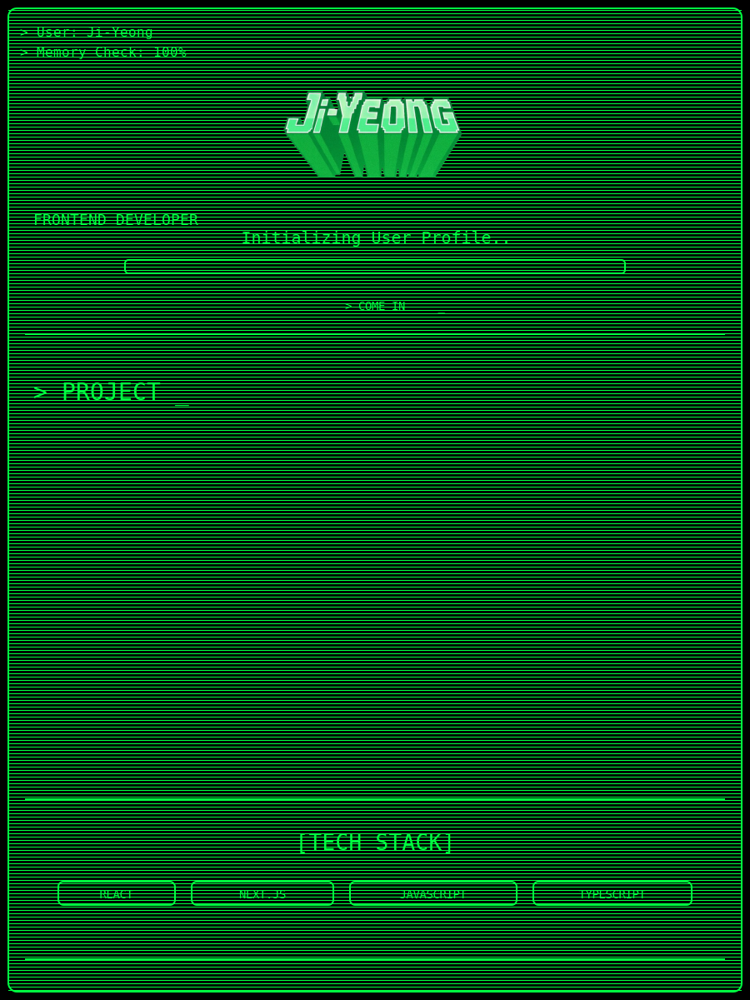

  
<code>&gt; HELLO_WORLD</code>
 

<table align="center">
  <tr>
    <td>
      <pre>
        
██╗  ██╗███████╗██╗     ██╗      ██████╗     ██╗    ██╗ ██████╗ ██████╗ ██╗     ██████╗
██║  ██║██╔════╝██║     ██║     ██╔═══██╗    ██║    ██║██╔═══██╗██╔══██╗██║     ██╔══██╗
███████║█████╗  ██║     ██║     ██║   ██║    ██║ █╗ ██║██║   ██║██████╔╝██║     ██║  ██║
██╔══██║██╔══╝  ██║     ██║     ██║   ██║    ██║███╗██║██║   ██║██╔══██╗██║     ██║  ██║
██║  ██║███████╗███████╗███████╗╚██████╔╝    ╚███╔███╔╝╚██████╔╝██║  ██║███████╗██████╔╝
╚═╝  ╚═╝╚══════╝╚══════╝╚══════╝ ╚═════╝ ,    ╚══╝╚══╝  ╚═════╝ ╚═╝  ╚═╝╚══════╝╚═════╝ !
      </pre>
    </td>
  </tr>
</table>

  <pre align="center">
    
    > SYSTEM BOOT SEQUENCE INITIATED
  </pre>

 

<!-- 

  <pre align="center">
    
██╗  ██╗███████╗██╗     ██╗      ██████╗     ██╗    ██╗ ██████╗ ██████╗ ██╗     ██████╗ 
██║  ██║██╔════╝██║     ██║     ██╔═══██╗    ██║    ██║██╔═══██╗██╔══██╗██║     ██╔══██╗
███████║█████╗  ██║     ██║     ██║   ██║    ██║ █╗ ██║██║   ██║██████╔╝██║     ██║  ██║
██╔══██║██╔══╝  ██║     ██║     ██║   ██║    ██║███╗██║██║   ██║██╔══██╗██║     ██║  ██║
██║  ██║███████╗███████╗███████╗╚██████╔╝    ╚███╔███╔╝╚██████╔╝██║  ██║███████╗██████╔╝
╚═╝  ╚═╝╚══════╝╚══════╝╚══════╝ ╚═════╝      ╚══╝╚══╝  ╚═════╝ ╚═╝  ╚═╝╚══════╝╚═════╝  
  </pre>

  <pre align="center">
    > SYSTEM BOOT SEQUENCE INITIATED
  </pre>

  -->

<!-- 
 -->

<!-- 

  
<code>&gt; HELLO_WORLD (BOOT BANNER)</code>

   
  

    <pre>
██╗  ██╗███████╗██╗     ██╗      ██████╗     ██╗    ██╗ ██████╗ ██████╗ ██╗     ██████╗ 
██║  ██║██╔════╝██║     ██║     ██╔═══██╗    ██║    ██║██╔═══██╗██╔══██╗██║     ██╔══██╗
███████║█████╗  ██║     ██║     ██║   ██║    ██║ █╗ ██║██║   ██║██████╔╝██║     ██║  ██║
██╔══██║██╔══╝  ██║     ██║     ██║   ██║    ██║███╗██║██║   ██║██╔══██╗██║     ██║  ██║
██║  ██║███████╗███████╗███████╗╚██████╔╝    ╚███╔███╔╝╚██████╔╝██║  ██║███████╗██████╔╝
╚═╝  ╚═╝╚══════╝╚══════╝╚══════╝ ╚═════╝  ,   ╚══╝╚══╝  ╚═════╝ ╚═╝  ╚═╝╚══════╝╚═════╝  !
    </pre>
    <pre align="center">
> SYSTEM BOOT SEQUENCE INITIATED
</pre>
  

 -->

<picture>
  <!-- <source media="(max-width: 640px)" srcset="./assets/intro/CRT_intro_mobile_v2.svg" /> -->
  
</picture>
